[](https://github.com/Coffee0297/CoffeeDingoConfig/releases)
[](https://github.com/corygrant/dingoConfig)

# CoffeeDingoConfig

Configuration, live-monitoring and firmware-update tool for **dingoPDM** power-distribution modules and
**CANBoard** I/O modules: a fork of [corygrant/dingoConfig](https://github.com/corygrant/dingoConfig),
rebuilt as one self-contained app (lean ASP.NET .NET 10 backend + Svelte SPA in your browser) for
**Windows, macOS and Linux**. It configures a whole vehicle at once rather than one module at a time: every
module on the bus, the wiring between them, Lua programs, firmware updates over CAN, and an MCP server so an
AI agent can do all of it too.

> **Firmware:** built for [CoffeeDingoFW](https://github.com/Coffee0297/CoffeeDingoFW). v0.8.0 expects
> **≥ 5.5.108** (PWM inputs, confirmed writes); older builds show a "firmware needs updating" notice and
> hide what they can't do. Want to try it without hardware? Point it at
> [CoffeeDingoSim](https://github.com/Coffee0297/CoffeeDingoSim), which runs the real firmware on a virtual bus.

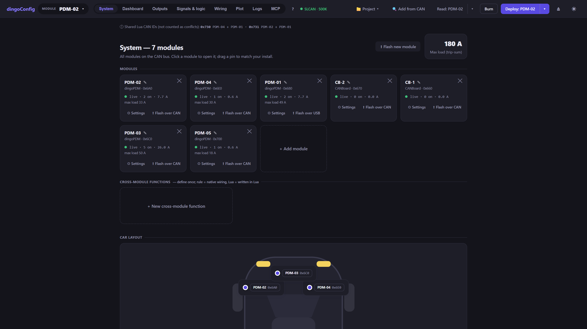

*All screenshots: five dingoPDMs and two CANBoards of one vehicle, running live in CoffeeDingoSim.*

## Compared with the original dingoConfig

Compared from source: the original's `main` is release **v0.2.17**; its `testing` branch holds the
pre-releases 0.3.0–0.4.2. "testing" below means the feature is only on that branch. ✅ = present, ❌ = absent.

| Feature | Original | This fork | Notes |
|---|---|---|---|
| Enter bootloader | ✅ | ✅ | The original stops there; flashing needs an external tool |
| **Flash firmware over USB DFU** from the app | ❌ | ✅ | dfu-util built in, progress bar, keeps the bootloader |
| **Flash a blank board** (DFU, no CAN link) | ❌ | ✅ | *Flash new module* + *Scan for DFU device* |
| **Flash firmware over CAN** (OpenBLT XCP, `.srec`) | ❌ | ✅ | Per module, the System card offers USB or CAN; also an MCP tool |
| Adapters: SLCAN, PCAN, SocketCAN, Sim replay | ✅ | ✅ | |
| Adapter: **Kvaser** (CANlib) | ❌ | ✅ | Windows |
| Adapter: **SLCAN over TCP** (`tcp://host:port`) | ❌ | ✅ | One click to CoffeeDingoSim (`tcp://127.0.0.1:7778`) |
| Adapter: separate dingoPDM "USB" | ✅ | ❌ | Dropped: the PDM's USB speaks SLCAN anyway |
| Works on a flooded bus (hardware accept-filter while reading/writing/flashing) | ❌ | ✅ | |
| Bus discovery, *Add from CAN* | ❌ | ✅ | Handles the PDM's base − 2 offset |
| **System view**: all modules, car-layout map, vehicle worst-case load | ❌ | ✅ | |
| **Wiring node graph** | testing | ✅ | Typed ports, wires that glow live, Circuit Builder wizards |
| Guided rule builder in the output editor | ❌ | ✅ | |
| Signals view with a live 30 s chart per row | partial | ✅ | |
| **Lua editor + upload** | ❌ | ✅ | Global + per-function pieces, runtime errors read back |
| Lua upload **verified by read-back** | ❌ | ✅ | A failed upload leaves the old program running |
| **Cross-module functions** + deploy | ❌ | ✅ | A rule compiles to native CAN wiring, or write it in Lua |
| CAN input from another module's broadcast signal | ❌ | ✅ | Searchable picker, `base + offset` |
| DBC devices and DBC-signal CAN inputs | ✅ | ✅ | Fork adds ECU import, search, float signals |
| CAN-ID conflict guard, *Suggest* free base ID | ❌ | ✅ | Plus `tools/canfree.py` offline |
| Live output cards | ✅ | ✅ | Fork adds a current sparkline, why it tripped, wire gauge / voltage drop |
| **Trip log** with the current waveform | ❌ | ✅ | |
| Global plot (any signal, any module) | testing | ✅ | PNG export |
| CAN log / system log, CSV export | ✅ | ✅ | Fork adds record / download |
| PWM output, duty from a signal | ✅ | ✅ | |
| PWM frequency from a signal; CANBoard output PWM | ❌ | ✅ | |
| **PWM input** (duty + Hz on a digital input) | ❌ | ✅ | Glitch filter, per-board frequency cap |
| Condition **hysteresis**, **timers**, **lookup tables** | ❌ | ✅ | |
| Analog: calibrated rotary (ladder designer, calibrate from switch), linear sensor | partial | ✅ | Original: uniform offset/step rotary only |
| Force-sleep / mute-TX / wake sources | testing | ✅ | Plus a shutdown & sleep sequence designer |
| Output bench test (force on / PWM) | ❌ | ✅ | |
| Keypads (Blink Marine / Grayhill) + SDO | ✅ | ✅ | |
| Write All with CRC | ✅ | ✅ | Fork retries, then falls back to acknowledged single writes |
| **Confirmed single writes** | ❌ | ✅ | A refused value is reported with what the module kept |
| Project as a local PC file, config diff (module vs project) | partial | ✅ | |
| **REST API** + **MCP server** for AI agents | ❌ | ✅ | ~57 tools, 11 skills |
| Unit tests + CI | ❌ | ✅ | |

**Known limitation:** project files from the original 0.3.0 and later keep PDMs and CANBoards in one
`Devices` list; this fork uses separate lists, so opening such a file loads no modules. Add the modules here
and *Read* them off the bus instead (their config lives on the modules).

## Guide

### Connect
1. Run `dingoConfig.exe` (or the macOS / Linux binary, see [Install & run](#install--run)); the browser opens
   at <http://localhost:5000>.
2. Pick the adapter, port (`COM3`, `/dev/ttyACM0`, or `tcp://127.0.0.1:7778` for the simulator) and bitrate.
3. **🔍 Add from CAN** finds every module and adds it at its base ID. *Read* pulls each config into the project.

### Change things
- **Outputs**: per output the rule that turns it on, current / inrush limit, reset mode, PWM or soft start, plus
  wire gauge hints. *Test* forces it on to check the wiring.
- **Signals & logic**: inputs (digital, PWM, analog switch / rotary / sensor, CAN), conditions, virtual
  inputs, flashers, counters, timers, tables. Each row shows its last 30 s live.
- **Wiring**: the same functions as a node graph. Drag from an output ● to an input ●; *Circuit builder…*
  creates common circuits (switched load, fuel pump prime + run, after-run fan) in one go.
- **Lua** (PDMs): anything the blocks can't do. The editor loads the program stored in the project; *Read
  from device* pulls the running one.
- **Across modules**: a CAN input can take another module's signal by name, and a *cross-module function*
  (System view) is written once and deployed to every module it touches.

### Save it
*Deploy* writes the project to the module, *Burn* stores it in its flash/FRAM. **Project ▾** saves the whole
vehicle as one JSON file.

### Update firmware
- A module running CoffeeDingoFW with the CAN bootloader: **⬆ Flash over CAN** on its System card, pick the
  `.srec`. No USB, the module stays in the car.
- Otherwise **⬆ Flash over USB** (`.bin`), or **⬆ Flash new module** for a blank board held in DFU (BOOT0 +
  reset).

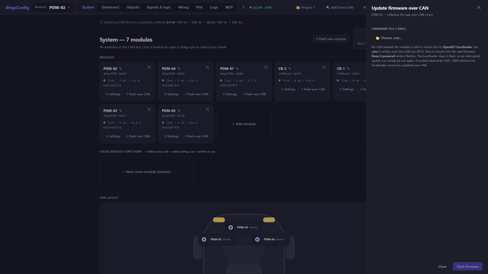

### Let an AI do it
Point Claude Code / Copilot CLI at `http://localhost:5000/mcp` (see [MCP](#drive-it-from-an-ai-model-mcp)).
Everything above is a tool: a request like "add a fan on PDM-02 output 4 that runs above 90 °C" can be carried out from one prompt.

### Troubleshoot
**Logs** shows the live CAN traffic per ID (record and download it), the system log, and each module's trip
log with the current around every trip.

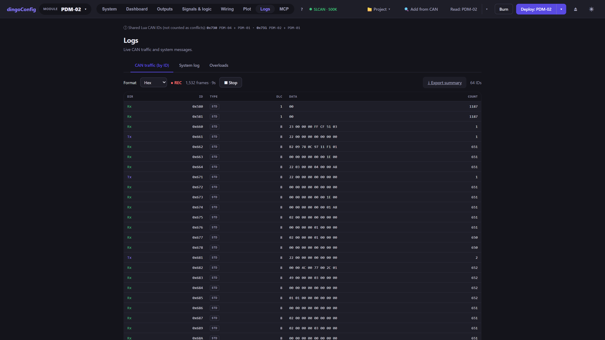

---

## Contents
- [Features](#features)
- [Supported hardware](#supported-hardware)
- [Install & run](#install--run)
- [Build from source](#build-from-source)
- [Distribute (Windows / macOS / Linux)](#distribute-windows--macos--linux)
- [Drive it from an AI model (MCP)](#drive-it-from-an-ai-model-mcp)
- [Project layout](#project-layout)

---

## Features

### System overview & car layout
Every module on the bus in one place — live current/temperature/state per module, a draggable
**car-layout map** to match your physical install, in-app **firmware update** and **⚙ Settings**
per module, and **cross-module functions** (define a behaviour once across modules). Live modules
show green; project modules not seen on the bus are flagged. Overlapping CAN-ID spans are flagged,
and **Add / Modify module** can **Suggest a collision-free base ID** (with an OBD-II reserve toggle
and a live free-window readout).

### Outputs — smart high-side switches
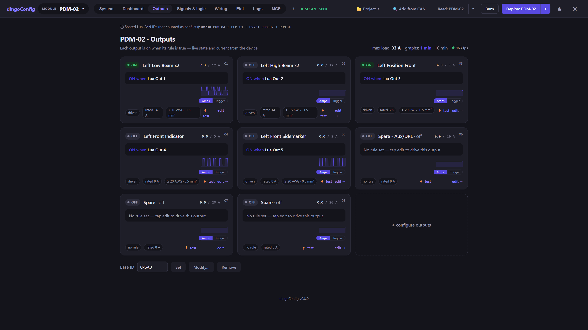

Each output is a current-sensing smart switch. Per output:
- **Input/rule** — the signal that turns it on (a pin, CAN signal, condition, virtual input, or Lua slot)
- **Current limit + inrush limit/time** — trip protection with a higher allowance during inrush (bulbs, motors)
- **Reset mode** — none / count (retry N times) / endless, with reset time
- **Warning limit & open-load detection** — flag a soft over-current or a disconnected load without tripping
- **PWM & soft-start** — drive at a duty cycle / frequency, or ramp up
- Live state + current, with a per-output mini graph

Save writes live to the device; **Burn** persists to flash.

### Signals & logic
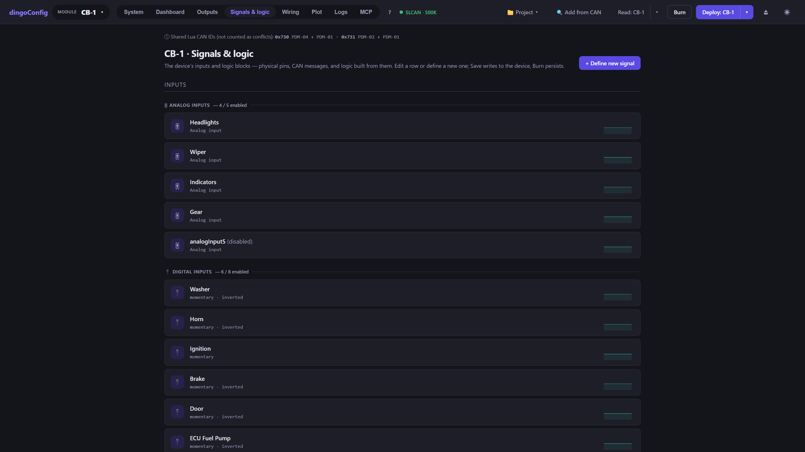

Build logic from physical pins and CAN messages. Each block type has a guided editor:
- **CAN input** — pull a value/bit out of an incoming frame (factor/offset/byte-order/signed), or
  **pull it from another module**: pick the source module + one of its wired-up broadcast signals and
  the ID/bits/scaling fill in (`base + offset`, so it survives the source being re-addressed)
- **Digital pin** — physical input (momentary/latched, pull, debounce, invert)
- **Condition** — true when a signal crosses a value
- **Virtual input** — AND/OR/NOR up to 3 signals
- **Flasher** — blink pattern (on/off times, single-shot)
- **Counter** — count up/down/reset events
- **CAN output** — transmit any variable on the bus
- **Analog input (CANBoard)** *(new in v0.5.0-rc.1, expanded in v0.6.0-rc.1)* — use one analog input
  as an **on/off switch** (single threshold), a **multi-position / rotary switch** (up to 10), **or**
  a **linear-scaled sensor** — mutually exclusive. For the switch: design a standard-resistor ladder
  (auto pull-up + even spread) or **calibrate an existing switch** by capturing the live voltage at
  each detent — uneven steps decode via per-position tolerance windows (a reading outside every window
  reads "no position"). For a sensor: enter two datasheet points (mV → value) and the input reads out
  in your **engineering units** (bar, °C, …), usable in Conditions/outputs. Needs CoffeeDingoFW
  ≥ v5.5.101. See [CHANGELOG](CHANGELOG.md).

Every row carries a **live mini-chart** (last 30 s) — the flasher rows above show their square-wave
output in real time.

### Wiring — node graph
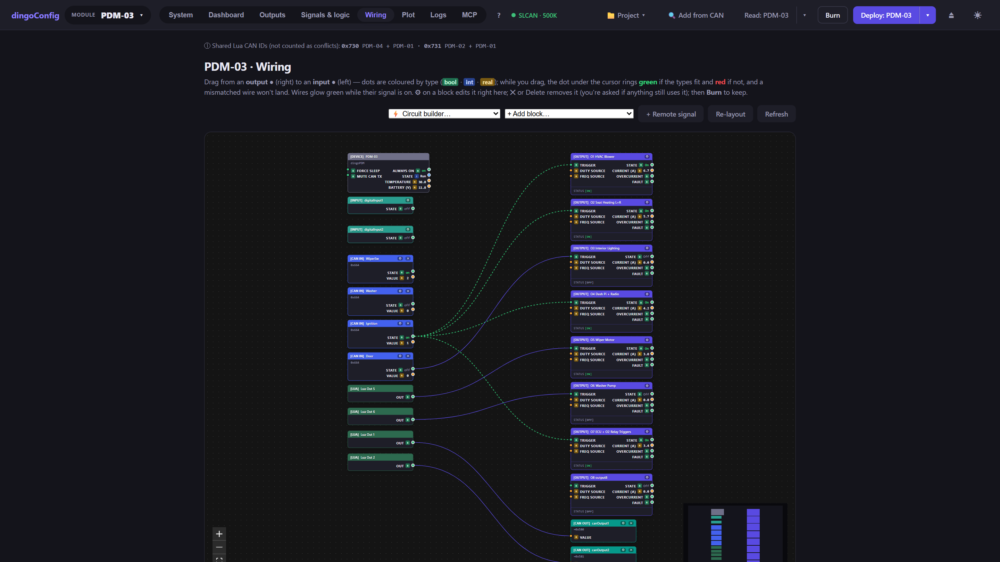

A visual node-graph of a module's functions. Drag from a **purple output ●** to a **green input ●**
to wire one function into another; delete a block with its **✕** or by selecting it and pressing
**Delete**. `+ Add node` creates functions; `+ Remote signal` pulls a signal from another module
over CAN. Changes write live — Burn to keep.

### Lua scripting
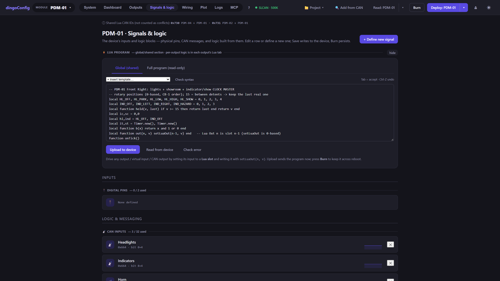

Any output / virtual input / CAN output can be driven by a **Lua slot**. There's a global/shared
section plus per-function snippets, assembled into one program and uploaded to the device
(`setTickRate`, `readVar`, `setLuaOut`, `txCan`, `canRxAdd`, `onCanRx`, timers, …). Runtime errors
are read back from the device.

### Cross-module functions
Define a behaviour once that spans modules (e.g. a synchronised blinker triggered on one PDM,
clocked by another). A **rule** compiles to native CAN-input/flasher/output wiring (no Lua);
switch it to **Lua** to write it yourself — needed for clock-failover. Deploy pushes it to every
involved module.

### CAN addressing & frame map
The System view flags modules whose CAN-ID spans overlap, and **Add / Modify module** suggests the
lowest collision-free base ID — with an **OBD-II diagnostic reserve toggle** (uncheck for buses with no
OBD) and a live free-window readout. The spans match the firmware's broadcast footprint
(CANBoard `base…+10`, dingoPDM `base…+28`).

[`docs/can-frame-map.md`](docs/can-frame-map.md) is the **address-agnostic CAN frame map** — what every
module type transmits, written as `base + offset` and bit layout (rotary switches, inputs, output
state/current, …). It's served at `/can-frame-map.md` and via the `get_frame_map` MCP tool, so it works
with no device connected. For offline work, [`tools/canfree.py`](tools/canfree.py) reads a **DBC or CAN
log** and reports free IDs + suggests collision-free base addresses
(`canfree bus.dbc --preset dingo:5pdm,2cb`).

### Plot
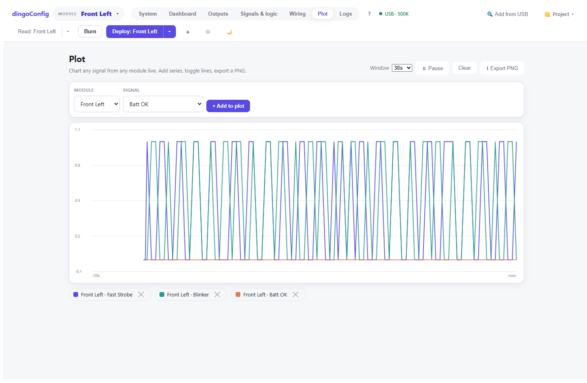

Chart **any signal from any module** live. Add as many series as you like, toggle lines via the
legend chips, pause, pick the time window, and **export a PNG**.

### Dashboard
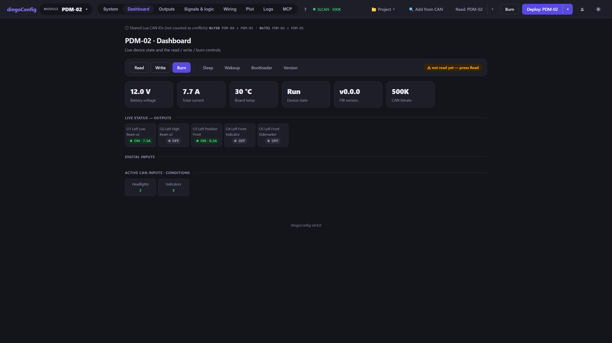

Live state of the selected module — battery, total current, board temperature, every output — plus
Read / Write / Burn and Sleep / Wakeup controls.

### Sleep (auto + input-driven)
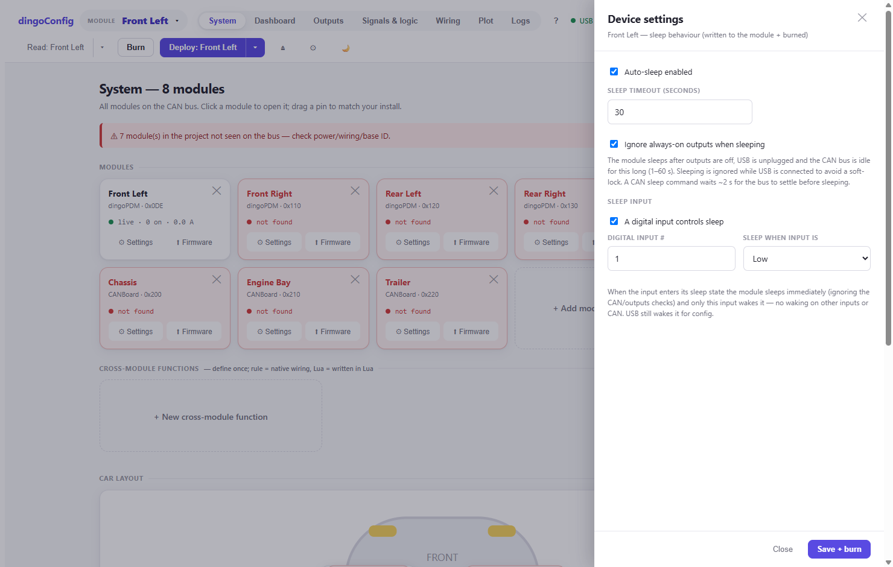

Per-module sleep behaviour, written and burned to the device:
- **Auto-sleep** with a configurable timeout (sleeps after outputs off, USB unplugged, CAN idle)
- **Ignore always-on outputs** so sleep can still be reached
- **Sleep input** — a digital input drives sleep directly; configurable sleep level; only that
  input wakes (no waking on other inputs/CAN); USB still wakes it for config
- A CAN sleep command waits ~2 s for the bus to settle, and sleeping is refused while USB is
  connected (prevents the wake-reset soft-lock)

### Firmware update (USB DFU or CAN)
Each module's System card offers **⬆ Flash over CAN** when it runs the OpenBLT CAN bootloader: the app
restarts it into the bootloader and writes the `.srec` over the bus (XCP), with no USB connection. Otherwise
**⬆ Flash over USB** commands it into DFU and writes the `.bin` with dfu-util, and **⬆ Flash new module**
programs a blank board held in DFU. Both show a live progress bar; BOOT0 recovery is always available.

### Keypads (Blink Marine / Grayhill)
Configure keypad buttons (action, LED colour, what the LED mirrors) and the keypad's own persistent
**CANopen device settings** via an **SDO** panel (read identity, save-to-NV, expert read/write of
any object-dictionary entry).

### DBC devices
Open a `.dbc` file, add custom signals, and read live decoded values from third-party CAN devices.

### Logs
Live CAN traffic and a system log, both exportable to CSV. Modules also keep an on-device
**overload (trip) log** with a current waveform around each trip, readable for troubleshooting.

### Contextual help
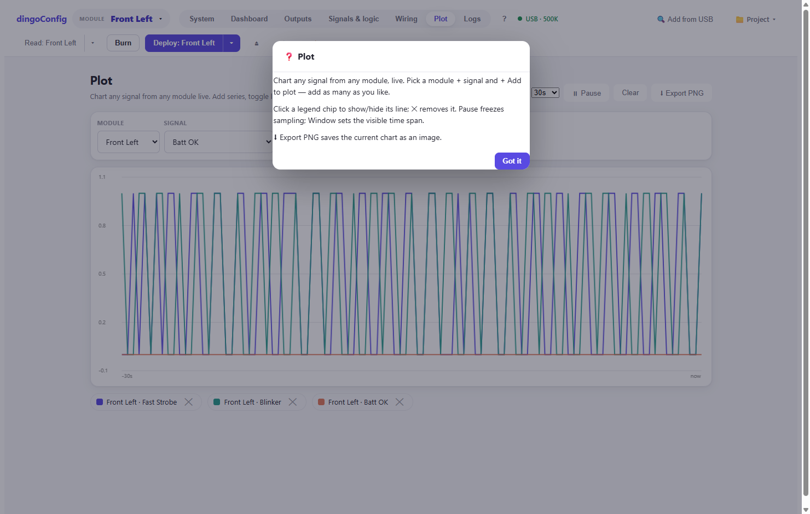

A **`?`** button in the top bar opens concise help for whatever view you're on.

---

## Supported hardware

**Adapters** (pick on the Connect screen):

| Adapter | Windows | macOS | Linux | Driver needed |
|---|:---:|:---:|:---:|---|
| **SLCAN** (CANable/CANtact serial, and a dingoPDM's own USB) | ✅ | ✅ | ✅ | none (plain serial / USB-CDC) |
| **PCAN** (PEAK) | ✅ | — | — | [PEAK driver](https://www.peak-system.com/Drivers.523.0.html) (provides `PCANBasic.dll`) |
| **Kvaser** (Leaf/USBcan/etc., via CANlib) | ✅ | — | — | [Kvaser drivers](https://www.kvaser.com/download/) (provide `canlib32.dll`) |
| **SocketCAN** | — | — | ✅ | in-kernel |
| **Sim** (replay a CAN capture) | ✅ | ✅ | ✅ | none |

> **PCAN/Kvaser drivers are NOT bundled** — they are vendor kernel drivers your CAN hardware needs
> regardless, so install them on each bench PC. The build itself needs nothing extra: the PCAN managed
> wrapper restores from NuGet on `git clone`, and Kvaser is called by P/Invoke (no package). The native
> driver DLL is loaded lazily only when you actually connect with that adapter; if it's missing, that
> adapter just fails to connect (the others still work).

**Modules:** dingoPDM (V7), dingoPDM-MAX, CANBoard, plus Blink Marine / Grayhill keypads and
generic DBC devices.

---

## Install & run

1. Download the zip for your platform from a release (or build it — see below) and unzip.
2. Run the app:
   - **Windows:** double-click `dingoConfig.exe` (a browser opens at <http://localhost:5000>).
   - **macOS:** `chmod +x dingoConfig` then run it. First launch is blocked by Gatekeeper
     (unsigned) — `xattr -dr com.apple.quarantine dingoConfig`, or right-click → Open. Browse to
     <http://localhost:5000>.
   - **Linux:** `chmod +x dingoConfig && ./dingoConfig`, then browse to <http://localhost:5000>.
     Serial access needs your user in the `dialout` group (`sudo usermod -aG dialout $USER`, re-login).
3. **Connect** — pick the adapter, port (e.g. `COM3` / `/dev/ttyACM0`), and bitrate (e.g. `500K`).
4. **🔍 Add from USB** scans the bus and adds each module at its correct base ID.
   > A dingoPDM broadcasts status starting at `BaseId + 2`, so a module whose status frames are at
   > `0x0E0…` has base ID `0x0DE`. Discovery handles this `−2` automatically — entering the broadcast
   > ID by hand is the classic "read hangs / is slow" trap.
5. **Read** the config, edit outputs/signals, **Deploy/Write** to push, **Burn** to persist to flash.
   **Project ▾** saves/opens configs as JSON (in `~/Documents/dingoConfig`).

No runtime install is required — the builds are self-contained (the .NET runtime is bundled).

---

## Build from source

Prerequisites: **.NET 10 SDK** and **Node 18+**.

```bash
# 1. Frontend — Vite emits the SPA into web/wwwroot (the backend serves it)
cd web/clientapp
npm install
npm run build

# 2. Run (serves http://localhost:5000)
cd ../..
dotnet run --project web -c Release
```

> Build the frontend **first** — the backend serves the SPA from `web/wwwroot`; without it the page
> is blank. `dotnet run --project web` sets the content root correctly. If you run the built DLL
> directly, run it from the `web/` folder (or pass `--contentRoot <path-to-web>`).

**Dev mode (hot-reload UI):** two terminals — Vite (`:5173`) proxies `/api` + `/hub` to the backend (`:5000`):
```bash
dotnet run --project web                 # terminal 1 → :5000 (API + CAN)
cd web/clientapp && npm run dev           # terminal 2 → :5173 (UI, hot reload)
```

---

## Distribute (Windows / macOS / Linux)

Use the bundled scripts — they build the SPA, then publish a **single self-contained launcher
`dingoConfig(.exe)` per platform** and zip each into `publish/dingoConfig-<version>/`. The SPA and
device definitions are **embedded in the exe**, so it's one file: copy it anywhere and run it — no
.NET install, no folder, no loose files.

```powershell
./publish.ps1     # run on Windows
```
```bash
./publish.sh      # run on macOS/Linux
```

Targets: `win-x64`, `win-arm64`, `linux-x64`, `linux-arm`, `linux-arm64`, `osx-x64`, `osx-arm64`
(~50–90 MB each). `LINUX` — which enables SocketCAN — is defined automatically for any `linux-*` RID.

Single target manually:
```bash
dotnet publish web/web.csproj -c Release -r osx-arm64 --self-contained true \
  -p:PublishSingleFile=true -p:EnableCompressionInSingleFile=true -p:DebugType=none -o publish/osx-arm64
```

> Want a Windows **installer** (Start-Menu entry, Add/Remove Programs)? Wrap that single exe with
> Inno Setup, WiX, or `dotnet publish -p:PublishProfile=…`/MSIX — but it isn't required, the exe
> runs as-is.

---

## Drive it from an AI model (MCP)

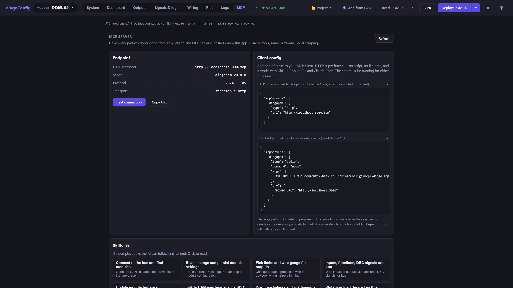

dingoConfig **hosts an MCP server inside the app** so AI clients can drive an entire system
directly — no UI automation. **Every UI capability is exposed as a tool (57)**, plus eleven guided
**skills** (playbooks). There's an in-app **MCP** tab (endpoint, *Test connection*, copy-paste
client configs, and the live tool + skill catalog).

- **Transport — HTTP (preferred):** `POST /mcp` (Streamable-HTTP JSON-RPC 2.0). Works with
  **GitHub Copilot CLI and Claude Code** out of the box — no script, no file path, app just has to
  be running. Config:
  ```json
  { "mcpServers": { "dingopdm": { "type": "http", "url": "http://localhost:5000/mcp" } } }
  ```
  The project [`.mcp.json`](.mcp.json) registers this for project-scoped clients (e.g. Claude Code).
- **Transport — stdio bridge (fallback):** [`mcp/dingo-mcp.mjs`](mcp/dingo-mcp.mjs) is a thin
  stdio→`/mcp` forwarder (zero-dependency, Node 18+) for stdio-only clients. Use an **absolute**
  path in `args` — stdio clients launch `node` from their own cwd, so a relative path fails
  ("Connection closed"). The MCP tab emits the correct absolute path; see [`mcp/README.md`](mcp/README.md).
- **Tools (57):** full UI + system coverage — connection (`list_adapters`/`connect`/`discover`/`identify`),
  devices (`add_device`/`read_device`/`device_action`/`apply_profile`/`get_definitions`), config
  (`get_schema`/`get_config`/`apply_config`/`get_frame_map`), outputs, params, signals & logic
  (`get_signals`/`set_function`/`get_lua`/`set_lua`), **cross-module** (`broadcast_signals`/`link_remote_signal`/`deploy_cross_module`),
  firmware (`flash_firmware`/`flash_blank`/`scan_dfu`/`flash_status`), keypad SDO, project
  (incl. `project_download`/`project_upload`), and logs.
- **Skills (11):** `connect-and-discover`, `configure-a-module`, `wire-outputs-safely`,
  `signals-and-logic`, **`lua-programming`** (the full on-device Lua API), **`cross-module-signals`**,
  **`cross-module-functions`**, **`can-addressing`**, `flash-firmware`, `keypad-sdo`, `logs-and-troubleshooting`.
- **Discovery:** `GET /mcp` (health) · `GET /mcp/info` (full catalog + copy-paste configs) ·
  `GET /mcp/skills[/{id}]` (playbooks) · [`/llms.txt`](http://localhost:5000/llms.txt) and
  [`AI-CONFIG.md`](AI-CONFIG.md) document the config surface.
- **Honest writes:** a tool result with `isError: true` means the operation did **not** complete
  (no device acknowledgement) — clients must never report success on it.

Agent loop: `connect → discover → read_device → get_schema → get_config → apply_config` — every
setting reachable by name (e.g. `device.sleepTimeoutMs`, `output[1].currentLimit`).

---

## Project layout

```
dingoConfig-redesign/
├── domain/            device model + CAN protocol (dingoPDM, CANBoard, keypads, DBC)
├── application/       services (DeviceManager, SystemConfigService, SdoService, …)
├── infrastructure/    CAN adapters (USB/SLCAN, PCAN, SocketCAN, Sim) + comms pipeline
├── web/               the app
│   ├── Program.cs         DI + serves the SPA + /api + SignalR (single process)
│   ├── Api/LiveApi.cs     REST /api/* + SignalR telemetry hub (/hub/live)
│   ├── Api/McpServer.cs   in-app MCP server (POST /mcp) — 57 tools + 11 skills, loops back to /api
│   ├── clientapp/         Svelte + Vite source → builds into ../wwwroot
│   └── wwwroot/           built SPA (generated by `npm run build`)
├── mcp/               stdio→HTTP bridge for MCP clients that don't speak HTTP
├── tools/canfree.py   offline CAN-ID free-space report + base-address allocator (DBC / CAN log)
├── docs/can-frame-map.md  address-agnostic CAN broadcast frame map (served at /can-frame-map.md)
├── AI-CONFIG.md       AI config-surface design
└── llms.txt           AI-client discovery doc (also served at /llms.txt)
```

The backend owns the serial/CAN port; the SPA talks to it over `/api` (REST) and `/hub/live`
(SignalR telemetry push). `web/wwwroot/` is generated from `web/clientapp` — rebuild it after UI changes.
